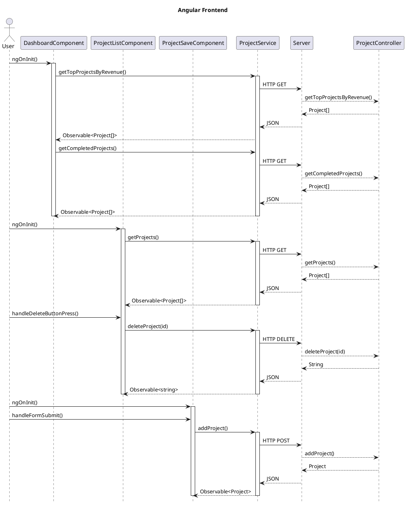
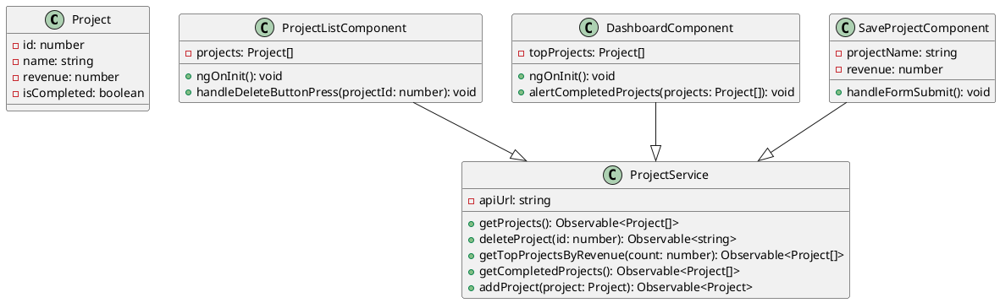
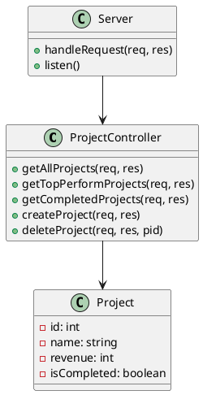

## Sequence Diagram

## Sequence diagram for loading a game window

```plantuml

@startuml
title Angular Frontend
hide footbox

actor User
participant DashboardComponent as DC

participant ProjectListComponent as PLC

participant ProjectSaveComponent as PSC

participant ProjectService as PS
participant Server as BE
participant ProjectController as PC

User -> DC: ngOnInit()
activate DC
DC -> PS: getTopProjectsByRevenue()
activate PS
PS -> BE: HTTP GET 
BE --> PC: getTopProjectsByRevenue()
PC --> BE: Project[]
BE --> PS: JSON 
PS --> DC: Observable<Project[]>


DC -> PS: getCompletedProjects()
PS -> BE: HTTP GET 
BE --> PC: getCompletedProjects()
PC --> BE: Project[]
BE --> PS: JSON 
PS --> DC: Observable<Project[]>
deactivate PS
deactivate DC


User -> PLC: ngOnInit()
activate PLC
PLC -> PS: getProjects()
activate PS
PS -> BE: HTTP GET 
BE --> PC: getProjects()
PC --> BE: Project[]
BE --> PS: JSON 
PS --> PLC: Observable<Project[]>
deactivate PS

User -> PLC: handleDeleteButtonPress()
PLC -> PS: deleteProject(id)
activate PS
PS -> BE: HTTP DELETE 
BE --> PC: deleteProject(id)
PC --> BE: String
BE --> PS: JSON 
PS --> PLC: Observable<string>
deactivate PS

deactivate PLC

User -> PSC: ngOnInit()
activate PSC
User -> PSC: handleFormSubmit()
PSC -> PS: addProject()
activate PS
PS -> BE: HTTP POST 
BE --> PC: addProject()
PC --> BE: Project
BE --> PS: JSON 
PS --> PSC: Observable<Project>
deactivate PS

deactivate PSC


@enduml

```

### Class Diagram for Front End

```plantuml

@startuml

class Project {
  - id: number
  - name: string
  - revenue: number
  - isCompleted: boolean
}

class ProjectService {
  - apiUrl: string
  + getProjects(): Observable<Project[]>
  + deleteProject(id: number): Observable<string>
  + getTopProjectsByRevenue(count: number): Observable<Project[]>
  + getCompletedProjects(): Observable<Project[]>
  + addProject(project: Project): Observable<Project>
}

class ProjectListComponent {
  - projects: Project[]
  + ngOnInit(): void
  + handleDeleteButtonPress(projectId: number): void
}

class DashboardComponent {
  - topProjects: Project[]
  + ngOnInit(): void
  + alertCompletedProjects(projects: Project[]): void
}

class SaveProjectComponent {
  - projectName: string
  - revenue: number
  + handleFormSubmit(): void
}

ProjectListComponent --|> ProjectService
DashboardComponent --|> ProjectService
SaveProjectComponent --|> ProjectService

@enduml


```
### Class Diagram for Back End

```plantuml

@startuml
class ProjectController {
  +getAllProjects(req, res)
  +getTopPerformProjects(req, res)
  +getCompletedProjects(req, res)
  +createProject(req, res)
  +deleteProject(req, res, pid)
}

class Server {
  +handleRequest(req, res)
  +listen()
}

class Project {
  -id: int
  -name: string
  -revenue: int
  -isCompleted: boolean
}

ProjectController --> Project 

Server --> ProjectController 

@enduml


```