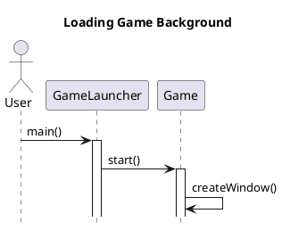
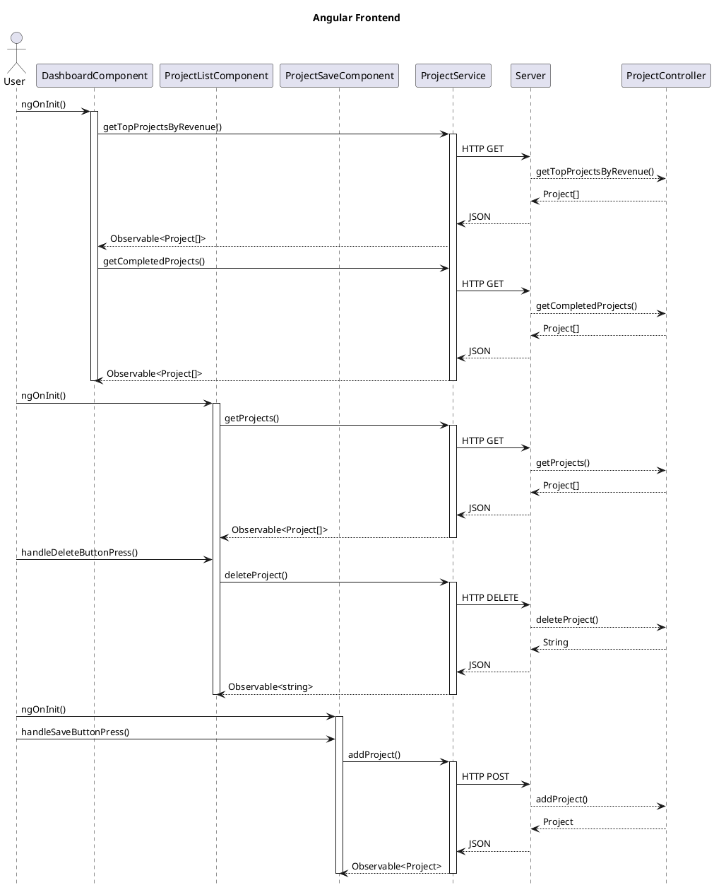

## Sequence Diagram

## Sequence diagram for loading a game window

```plantuml

@startuml
title Loading Game Background
hide footbox

actor User
participant GameLauncher as GL
participant Game as GE

User -> GL: main()
activate GL
GL -> GE: start()
activate GE
GE -> GE: createWindow()


```

```plantuml

@startuml
title Loading Game Background
hide footbox

actor User
participant GameLauncher as GL
participant Game as GE

User -> GL: load()
activate GL
GL -> GE: init()
activate GE
GE -> GE: createWindow()


```

```plantuml

@startuml
title Angular Frontend
hide footbox

actor User
participant DashboardComponent as DC

participant ProjectListComponent as PLC

participant ProjectSaveComponent as PSC

participant ProjectService as PS
participant Server as BE
participant ProjectController as PC

User -> DC: ngOnInit()
activate DC
DC -> PS: getTopProjectsByRevenue()
activate PS
PS -> BE: HTTP GET 
BE --> PC: getTopProjectsByRevenue()
PC --> BE: Project[]
BE --> PS: JSON 
PS --> DC: Observable<Project[]>


DC -> PS: getCompletedProjects()
PS -> BE: HTTP GET 
BE --> PC: getCompletedProjects()
PC --> BE: Project[]
BE --> PS: JSON 
PS --> DC: Observable<Project[]>
deactivate PS
deactivate DC


User -> PLC: ngOnInit()
activate PLC
PLC -> PS: getProjects()
activate PS
PS -> BE: HTTP GET 
BE --> PC: getProjects()
PC --> BE: Project[]
BE --> PS: JSON 
PS --> PLC: Observable<Project[]>
deactivate PS

User -> PLC: handleDeleteButtonPress()
PLC -> PS: deleteProject()
activate PS
PS -> BE: HTTP DELETE 
BE --> PC: deleteProject()
PC --> BE: String
BE --> PS: JSON 
PS --> PLC: Observable<string>
deactivate PS

deactivate PLC

User -> PSC: ngOnInit()
activate PSC
User -> PSC: handleSaveButtonPress()
PSC -> PS: addProject()
activate PS
PS -> BE: HTTP POST 
BE --> PC: addProject()
PC --> BE: Project
BE --> PS: JSON 
PS --> PSC: Observable<Project>
deactivate PS

deactivate PSC


@enduml

```

