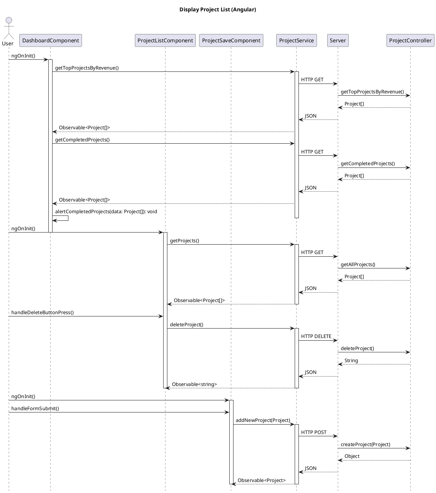
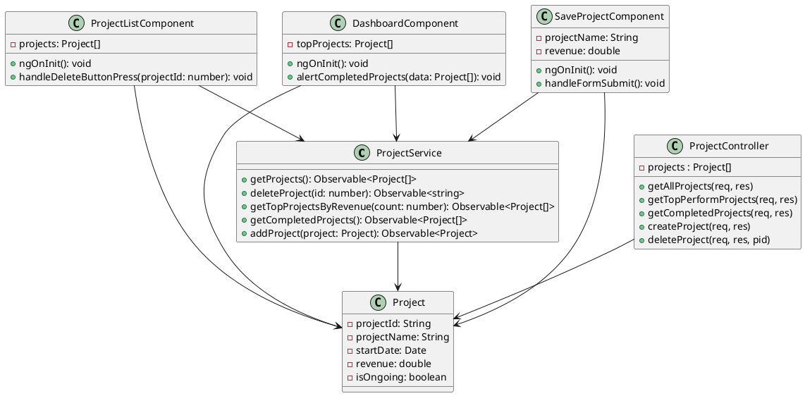

# Angular Sequence Diagrams

```plantuml

@startuml
title Display Project List (Angular)
hide footbox

actor User
participant DashboardComponent as DC

participant ProjectListComponent as PLC

participant ProjectSaveComponent as PSC

participant ProjectService as PS
participant Server as BE
participant ProjectController as PC

User -> DC: ngOnInit()
activate DC
DC -> PS: getTopProjectsByRevenue()
activate PS
PS -> BE: HTTP GET 
BE -> PC: getTopProjectsByRevenue()
PC --> BE: Project[]
BE --> PS: JSON 
PS --> DC: Observable<Project[]>


DC -> PS: getCompletedProjects()
PS -> BE: HTTP GET 
BE -> PC: getCompletedProjects()
PC --> BE: Project[]
BE --> PS: JSON 
PS --> DC: Observable<Project[]>
DC -> DC: alertCompletedProjects(data: Project[]): void
deactivate PS


User -> PLC: ngOnInit()
deactivate DC
activate PLC
PLC -> PS: getProjects()
activate PS
PS -> BE: HTTP GET 
BE -> PC: getAllProjects()
PC --> BE: Project[]
BE --> PS: JSON 
PS --> PLC: Observable<Project[]>
deactivate PS

User -> PLC: handleDeleteButtonPress()
PLC -> PS: deleteProject()
activate PS
PS -> BE: HTTP DELETE 
BE -> PC: deleteProject()
PC --> BE: String
BE --> PS: JSON 
PS --> PLC: Observable<string>
deactivate PS

deactivate PLC

User -> PSC: ngOnInit()
activate PSC
User -> PSC: handleFormSubmit()
PSC -> PS: addNewProject(Project)
activate PS
PS -> BE: HTTP POST 
BE -> PC: createProject(Project)
PC --> BE: Object
BE --> PS: JSON 
PS --> PSC: Observable<Project>
deactivate PS

deactivate PSC


@enduml

```

### Class Diagram 

```plantuml
@startuml
top to bottom direction

class ProjectService{
    +getProjects(): Observable<Project[]>
    +deleteProject(id: number): Observable<string>
    +getTopProjectsByRevenue(count: number): Observable<Project[]>
    +getCompletedProjects(): Observable<Project[]>
    +addProject(project: Project): Observable<Project>
}

class Project{
    -projectId: String
    -projectName: String
    -startDate: Date
    -revenue: double
    -isOngoing: boolean
}

class ProjectListComponent{
    -projects: Project[]
    +ngOnInit(): void
    +handleDeleteButtonPress(projectId: number): void
}

class DashboardComponent{
    -topProjects: Project[]
    +ngOnInit(): void
    +alertCompletedProjects(data: Project[]): void
}

class SaveProjectComponent{
    -projectName: String
    -revenue: double
    +ngOnInit(): void
    +handleFormSubmit(): void
}

class ProjectController {
    -projects : Project[]
  +getAllProjects(req, res)
  +getTopPerformProjects(req, res)
  +getCompletedProjects(req, res)
  +createProject(req, res)
  +deleteProject(req, res, pid)
}


ProjectListComponent --> ProjectService
DashboardComponent --> ProjectService
SaveProjectComponent --> ProjectService

ProjectListComponent --> Project
DashboardComponent --> Project
SaveProjectComponent --> Project

ProjectService --> Project
ProjectController --> Project


@enduml


```