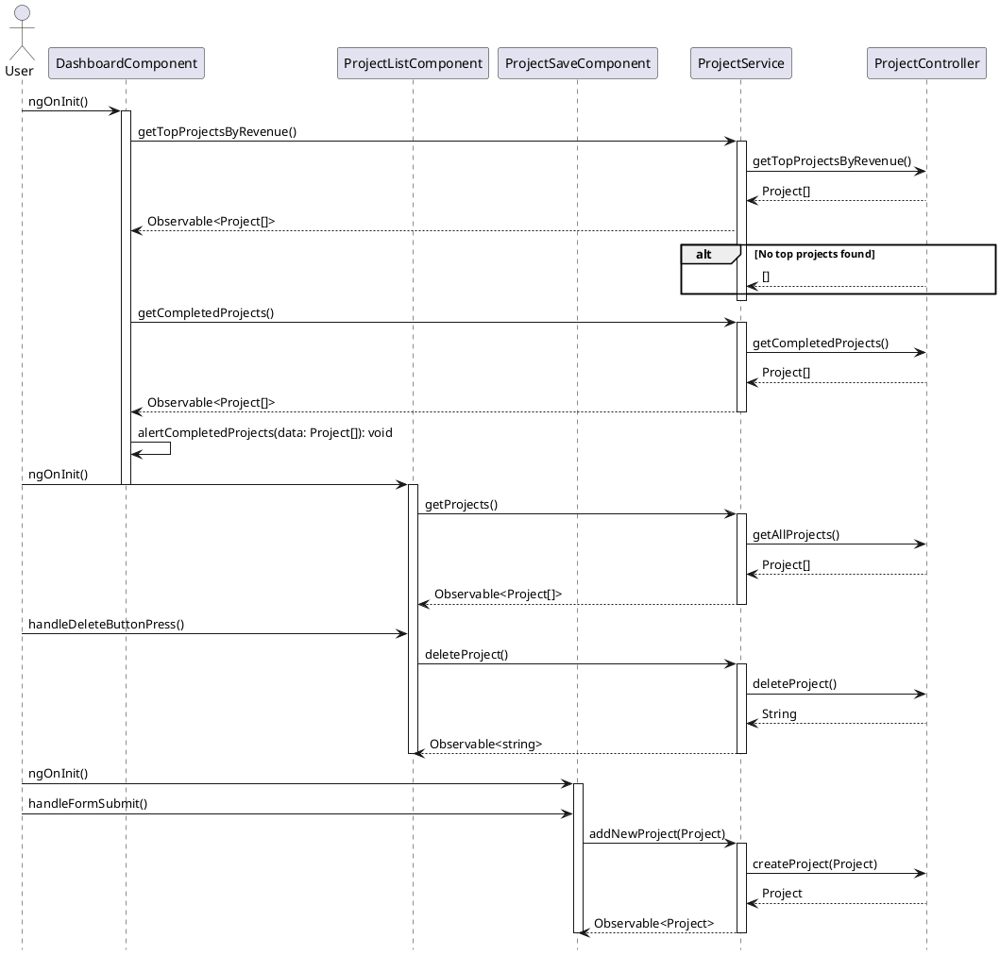

```plantuml

@startuml
hide footbox

actor User

participant DashboardComponent as DC
participant ProjectListComponent as PLC
participant ProjectSaveComponent as PSC
participant ProjectService as PS

participant ProjectController as PC

User -> DC: ngOnInit()
activate DC
DC -> PS: getTopProjectsByRevenue()
activate PS
PS -> PC: getTopProjectsByRevenue()
PC --> PS: Project[]
PS --> DC: Observable<Project[]>

alt No top projects found

PC --> PS: []

end

deactivate PS

DC -> PS: getCompletedProjects()
activate PS
PS -> PC: getCompletedProjects()
PC --> PS: Project[]
PS --> DC: Observable<Project[]>
deactivate PS
DC -> DC: alertCompletedProjects(data: Project[]): void
deactivate PS

User -> PLC: ngOnInit()
deactivate DC
activate PLC
PLC -> PS: getProjects()
activate PS
PS -> PC: getAllProjects()
PC --> PS: Project[]
PS --> PLC: Observable<Project[]>
deactivate PS

User -> PLC: handleDeleteButtonPress()
PLC -> PS: deleteProject()
activate PS
PS -> PC:  deleteProject()
PC --> PS: String
PS --> PLC: Observable<string>
deactivate PS
deactivate PLC

User -> PSC: ngOnInit()
activate PSC
User -> PSC: handleFormSubmit()
PSC -> PS: addNewProject(Project)
activate PS
PS -> PC: createProject(Project)
PC --> PS: Project
PS --> PSC: Observable<Project>
deactivate PS
deactivate PSC

@enduml


```