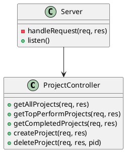

## Class Diagram for Backend

```plantuml

@startuml
class ProjectController {
  +getAllProjects(req, res)
  +getTopPerformProjects(req, res)
  +getCompletedProjects(req, res)
  +createProject(req, res)
  +deleteProject(req, res, pid)
}

class Server {
  -handleRequest(req, res)
  +listen()
}


Server --> ProjectController 

@enduml


```

