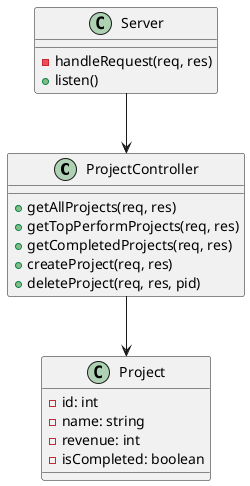

```plantuml

@startuml
class ProjectController {
  +getAllProjects(req, res)
  +getTopPerformProjects(req, res)
  +getCompletedProjects(req, res)
  +createProject(req, res)
  +deleteProject(req, res, pid)
}

class Server {
  -handleRequest(req, res)
  +listen()
}

class Project {
  -id: int
  -name: string
  -revenue: int
  -isCompleted: boolean
}

ProjectController --> Project 

Server --> ProjectController 

@enduml


```

