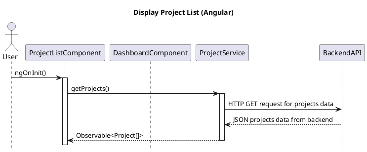
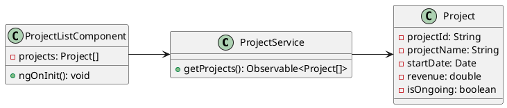
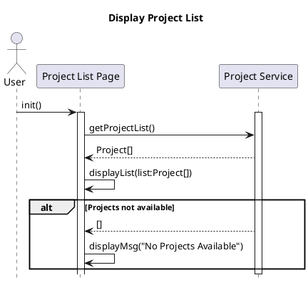
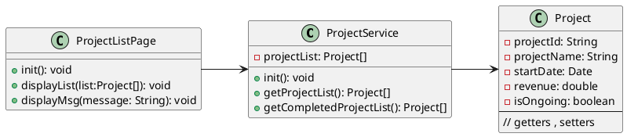
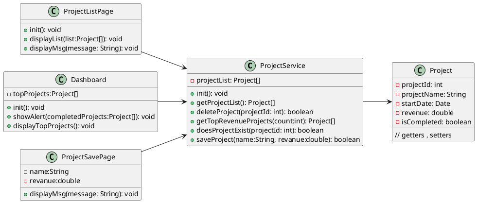

# Angular Sequence Diagrams

## Project List

```plantuml

@startuml
title Display Project List (Angular)
hide footbox

actor User

participant ProjectListComponent as PLC
participant DashboardComponent as DC
participant ProjectService as PS
participant BackendAPI as BE


User -> PLC: ngOnInit()
activate PLC
PLC -> PS: getProjects()
activate PS
PS -> BE: HTTP GET request for projects data
BE --> PS: JSON projects data from backend
PS --> PLC: Observable<Project[]>
deactivate PS


@enduml

```

###

```plantuml
@startuml
left to right direction

class ProjectService{
    +getProjects(): Observable<Project[]>
}

class Project{
    -projectId: String
    -projectName: String
    -startDate: Date
    -revenue: double
    -isOngoing: boolean
}

class ProjectListComponent{
    -projects: Project[]
    +ngOnInit(): void
}


ProjectListComponent --> ProjectService
ProjectService --> Project


@enduml


```

# Old

## Sequence Diagram

```plantuml

@startuml
title Display Project List
hide footbox

actor User

participant "Project List Page" as ProjectListPage
participant "Project Service" as DS


User -> ProjectListPage: init()
activate ProjectListPage


activate DS
ProjectListPage -> DS: getProjectList()

DS --> ProjectListPage: Project[]
ProjectListPage -> ProjectListPage: displayList(list:Project[])

alt Projects not available
DS --> ProjectListPage: []
ProjectListPage -> ProjectListPage: displayMsg("No Projects Available")
end


deactivate DS


@enduml

```

## Sequence diagram to Class Diagram

```plantuml
@startuml
left to right direction

class ProjectService{
    +init(): void
    -projectList: Project[]
    +getProjectList(): Project[]
    +getCompletedProjectList(): Project[]
}

class Project{
    -projectId: String
    -projectName: String
    -startDate: Date
    -revenue: double
    -isOngoing: boolean
    --
    // getters , setters
}

class ProjectListPage{
    +init(): void
    +displayList(list:Project[]): void
    +displayMsg(message: String): void
}


ProjectListPage --> ProjectService
ProjectService --> Project


@enduml


```

## Complete Class Diagram for P.M System

```plantuml
@startuml
left to right direction


class ProjectService{
    
    +init(): void
    -projectList: Project[]
    +getProjectList(): Project[]
    +deleteProject(projectId: int): boolean
    +getTopRevenueProjects(count:int): Project[]
    +doesProjectExist(projectId: int): boolean
    +saveProject(name:String, revanue:double): boolean
    
}

class Project{
    -projectId: int
    -projectName: String
    -startDate: Date
    -revenue: double
    -isCompleted: boolean
    --
    // getters , setters
}

class ProjectListPage{
    +init(): void
    +displayList(list:Project[]): void
    +displayMsg(message: String): void
}


class Dashboard{
    -topProjects:Project[]
    +init(): void
    +showAlert(completedProjects:Project[]): void
    +displayTopProjects(): void
}

class ProjectSavePage{
    -name:String
    -revanue:double
    +displayMsg(message: String): void
}


ProjectSavePage --> ProjectService
ProjectListPage --> ProjectService
Dashboard --> ProjectService
ProjectService --> Project


@enduml


```