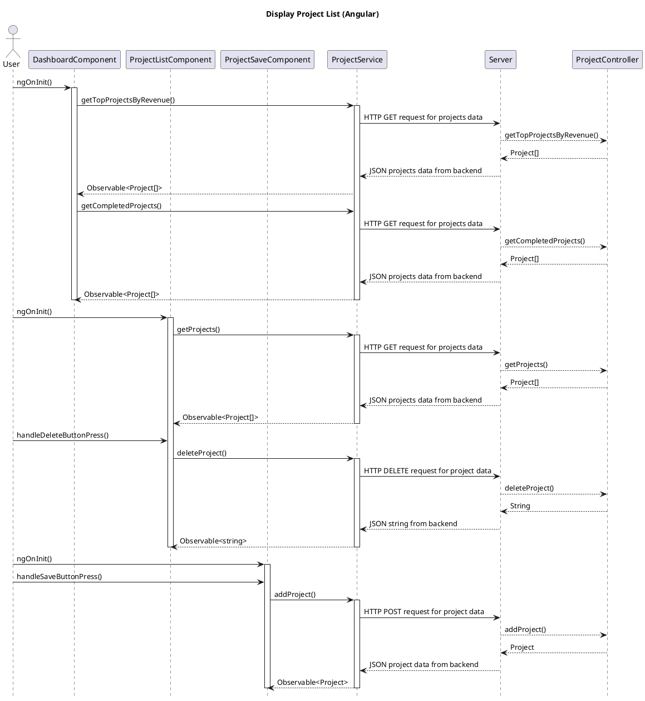
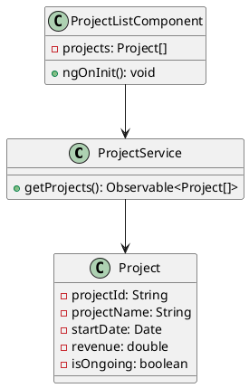
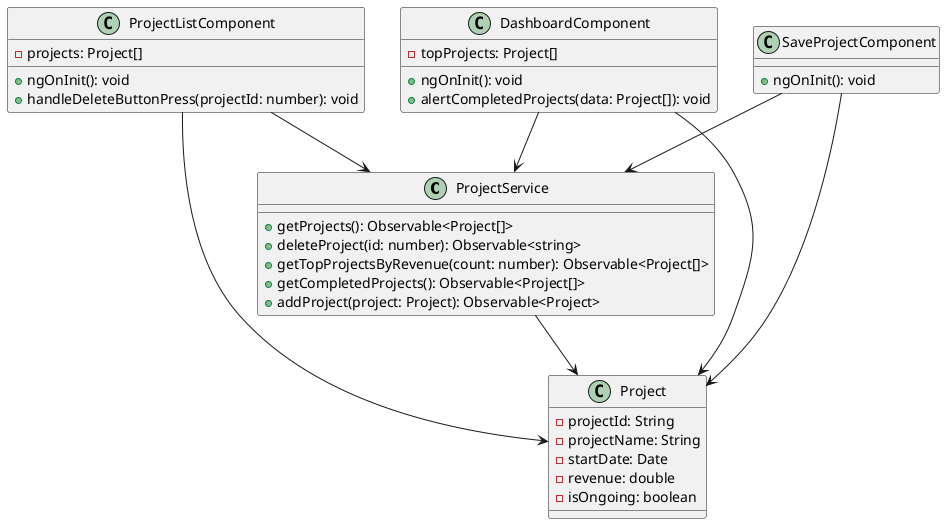
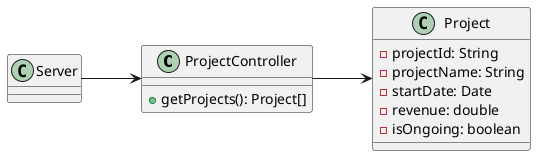

# Angular Sequence Diagrams

## Project List

```plantuml

@startuml
title Display Project List (Angular)
hide footbox

actor User
participant DashboardComponent as DC

participant ProjectListComponent as PLC

participant ProjectSaveComponent as PSC

participant ProjectService as PS
participant Server as BE
participant ProjectController as PC

User -> DC: ngOnInit()
activate DC
DC -> PS: getTopProjectsByRevenue()
activate PS
PS -> BE: HTTP GET request for projects data
BE --> PC: getTopProjectsByRevenue()
PC --> BE: Project[]
BE --> PS: JSON projects data from backend
PS --> DC: Observable<Project[]>


DC -> PS: getCompletedProjects()
PS -> BE: HTTP GET request for projects data
BE --> PC: getCompletedProjects()
PC --> BE: Project[]
BE --> PS: JSON projects data from backend
PS --> DC: Observable<Project[]>
deactivate PS
deactivate DC


User -> PLC: ngOnInit()
activate PLC
PLC -> PS: getProjects()
activate PS
PS -> BE: HTTP GET request for projects data
BE --> PC: getProjects()
PC --> BE: Project[]
BE --> PS: JSON projects data from backend
PS --> PLC: Observable<Project[]>
deactivate PS

User -> PLC: handleDeleteButtonPress()
PLC -> PS: deleteProject()
activate PS
PS -> BE: HTTP DELETE request for project data
BE --> PC: deleteProject()
PC --> BE: String
BE --> PS: JSON string from backend
PS --> PLC: Observable<string>
deactivate PS

deactivate PLC

User -> PSC: ngOnInit()
activate PSC
User -> PSC: handleSaveButtonPress()
PSC -> PS: addProject()
activate PS
PS -> BE: HTTP POST request for project data
BE --> PC: addProject()
PC --> BE: Project
BE --> PS: JSON project data from backend
PS --> PSC: Observable<Project>
deactivate PS

deactivate PSC


@enduml

```

### Class Diagram for Angular Frontend

```plantuml
@startuml
top to bottom direction

class ProjectService{
    +getProjects(): Observable<Project[]>
}

class Project{
    -projectId: String
    -projectName: String
    -startDate: Date
    -revenue: double
    -isOngoing: boolean
}

class ProjectListComponent{
    -projects: Project[]
    +ngOnInit(): void
}


ProjectListComponent --> ProjectService
ProjectService --> Project


@enduml


```

### Class Diagram for Angular Frontend (All)

```plantuml
@startuml
top to bottom direction

class ProjectService{
    +getProjects(): Observable<Project[]>
    +deleteProject(id: number): Observable<string>
    +getTopProjectsByRevenue(count: number): Observable<Project[]>
    +getCompletedProjects(): Observable<Project[]>
    +addProject(project: Project): Observable<Project>
}

class Project{
    -projectId: String
    -projectName: String
    -startDate: Date
    -revenue: double
    -isOngoing: boolean
}

class ProjectListComponent{
    -projects: Project[]
    +ngOnInit(): void
    +handleDeleteButtonPress(projectId: number): void
}

class DashboardComponent{
    -topProjects: Project[]
    +ngOnInit(): void
    +alertCompletedProjects(data: Project[]): void
}

class SaveProjectComponent{
    +ngOnInit(): void
}


ProjectListComponent --> ProjectService
DashboardComponent --> ProjectService
SaveProjectComponent --> ProjectService

ProjectListComponent --> Project
DashboardComponent --> Project
SaveProjectComponent --> Project

ProjectService --> Project


@enduml


```

### Class Diagram for NodeJS Backend

```plantuml
@startuml
left to right direction

class ProjectController{
    +getProjects(): Project[]
}

class Project{
    -projectId: String
    -projectName: String
    -startDate: Date
    -revenue: double
    -isOngoing: boolean
}

class Server{

}

Server --> ProjectController
ProjectController --> Project


@enduml


```

