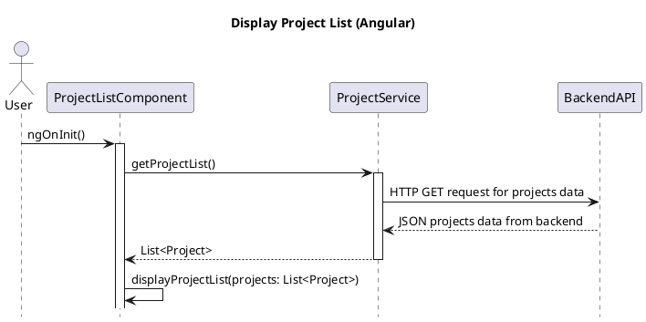

# Angular Sequence Diagrams

## Project List

```plantuml

@startuml
title Display Project List (Angular)
hide footbox

actor User

participant ProjectListComponent as PLC
participant ProjectService as PS
participant BackendAPI as PC


User -> PLC: ngOnInit()
activate PLC
PLC -> PS: getProjectList()
activate PS
PS -> PC: HTTP GET request for projects data
PC --> PS: JSON projects data from backend
PS --> PLC: List<Project> 
deactivate PS

PLC -> PLC: displayProjectList(projects: List<Project>)


@enduml

```