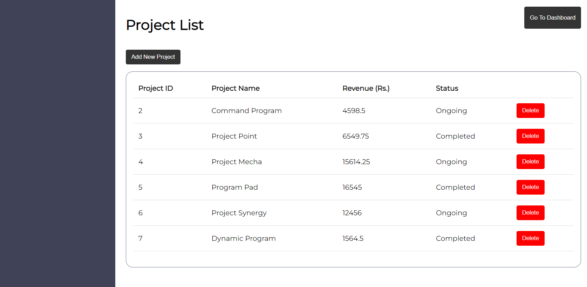
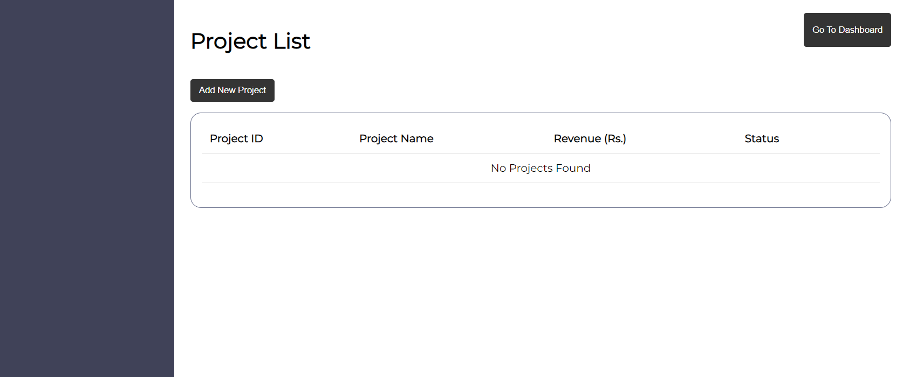
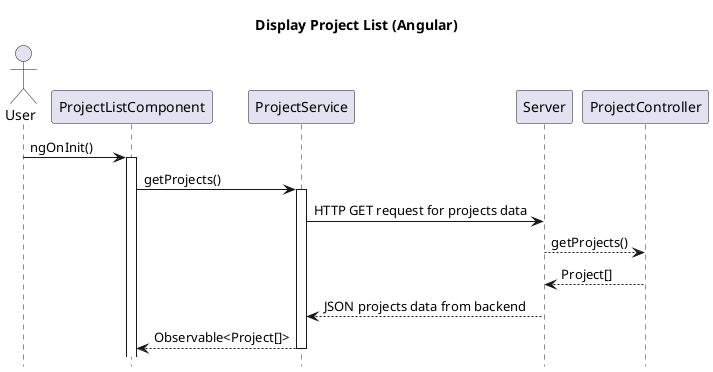

## As a user I want to see a list of projects on a dedicated page so that I get an overview of all the projects that I am managing.

**Decription:**
Any user who is using the system want to have the ability to get a overview of all the projects that they are managing. This can include both ongoing and completed projects. For this the user want a dedicated page they can access this list of all projects and view them presented in table format. The table should display the important information about each project such as the Project ID. Project Name, Status and Revanue

### User/Data Flows:
- User navigates to the project list page from Dashboard by clicking the *Project List* button. 
- System retrives the list of project from the Backend Server
- the retrived list of projects are displayed

#### Acceptance Criteria:
- Display List of projects in a table.
- If there are no projects to display , display a message on the project list page saying "No Projects Found".

### UI:
##### Case 1 : There are projects in the project list 

##### Case 2 : There are no projects in the project list

# Sequence Diagram

